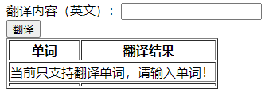
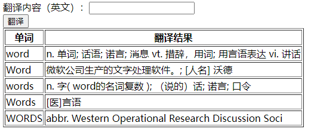

# FanyiDemo

## Version 1.0
+ 进度
    + [x] 翻译按钮指向TranslateServlet
    + [x] 翻译
        + [x] java实现发送post请求
            + [x] 修改HttpUtil
        + [x] 执行时无法解析到fastjson依赖
            + `java.lang.ClassNotFoundException: com.alibaba.fastjson.JSONObject`
            + 解决方法：Java项目 转成 maven项目
        + [x] 解析请求返回的结果
    + [x] 翻译结果输出在网页
        + [x] 直接打印Json
        + [x] 解析Json，打印在表格
    + [x] 非单词时进行提示

+ 展示

    

    
